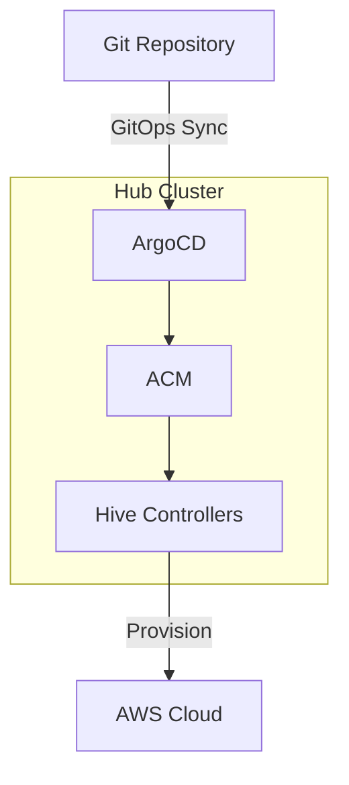

# OpenShift Cluster Provisioning with ArgoCD, ACM, and Hive

GitOps-based automation for provisioning and managing OpenShift clusters on AWS using Red Hat Advanced Cluster Management (ACM) and Hive.

## Overview

This repository provides a declarative, GitOps approach to OpenShift cluster lifecycle management:

- **ArgoCD**: Continuous deployment and cluster configuration management
- **ACM**: Multi-cluster management and governance
- **Hive**: Automated OpenShift cluster provisioning on cloud platforms

## Architecture



See [docs/architecture.md](docs/architecture.md) for detailed component interactions.

## Directory Structure

```
.
├── bootstrap/                    # ArgoCD bootstrap resources
│   ├── argocd-project.yaml      # AppProject with Hive/ACM permissions
│   ├── argocd-app-of-apps.yaml  # App-of-Apps pattern
│   └── deprovision-cleanup-cronjob.yaml
├── cluster-templates/            # Reusable cluster templates
│   └── aws-ha/base/             # AWS HA cluster template
├── clusters/                     # Cluster instances
│   └── <cluster-name>/          # One directory per cluster
├── post-provision-tasks/         # Automated post-provision tasks
│   └── ssl/base/                # SSL certificate setup
├── secrets/                      # Secrets management guide
└── docs/                         # Detailed documentation
```

## Prerequisites

### Core Components
- OpenShift 4.12+ hub cluster
- Red Hat ACM 2.8+ installed
- OpenShift GitOps (ArgoCD) installed
- AWS account with appropriate permissions
- Route53 DNS zone for cluster domain

### SSL Certificate Automation (Required for Post-Provision SSL)
- **cert-manager operator** installed on hub cluster
- **ClusterIssuer** configured for Let's Encrypt (see SSL setup below)
- **AWS Route53 credentials** for DNS-01 challenge validation
- **Route53 hosted zone** for your base domain

### SSL Configuration Setup
Before deploying clusters, configure SSL certificate automation:

```bash
# 1. Install cert-manager (if not already installed)
oc apply -f https://github.com/cert-manager/cert-manager/releases/download/v1.13.0/cert-manager.yaml

# 2. Create AWS credentials secret for cert-manager Route53 access
oc create secret generic opl-cert-manager-aws -n cert-manager \
  --from-literal=access-key-id="YOUR_AWS_ACCESS_KEY_ID" \
  --from-literal=secret_access_key="YOUR_AWS_SECRET_ACCESS_KEY"

# 3. Create ClusterIssuer for Let's Encrypt
cat <<EOF | oc apply -f -
apiVersion: cert-manager.io/v1
kind: ClusterIssuer
metadata:
  name: letsencrypt
spec:
  acme:
    email: your-email@company.com
    server: https://acme-v02.api.letsencrypt.org/directory
    privateKeySecretRef:
      name: letsencrypt-account-key
    solvers:
    - dns01:
        route53:
          accessKeyID: "YOUR_AWS_ACCESS_KEY_ID"
          region: us-east-1
          secretAccessKeySecretRef:
            name: opl-cert-manager-aws
            key: secret_access_key
EOF
```

**Important:** Replace `YOUR_AWS_ACCESS_KEY_ID`, `YOUR_AWS_SECRET_ACCESS_KEY`, and `your-email@company.com` with your actual values.

See [docs/prerequisites.md](docs/prerequisites.md) for detailed installation steps.

## Quick Start

### 1. Clone and configure

```bash
git clone https://github.com/your-org/opl-argocd.git
cd opl-argocd

# Update repoURL in bootstrap/argocd-app-of-apps.yaml
```

### 2. Apply bootstrap resources

```bash
# Grant ArgoCD cluster-admin
oc create clusterrolebinding openshift-gitops-cluster-admin \
  --clusterrole=cluster-admin \
  --serviceaccount=openshift-gitops:openshift-gitops-argocd-application-controller

# Apply bootstrap
oc apply -f bootstrap/
```

### 3. Create cluster secrets

```bash
# Create namespace
oc create namespace <cluster-name>

# AWS credentials
oc create secret generic aws-credentials \
  --from-literal=aws_access_key_id=<key> \
  --from-literal=aws_secret_access_key=<secret> \
  -n <cluster-name>

# Pull secret (from console.redhat.com)
oc create secret generic pull-secret \
  --from-file=.dockerconfigjson=pull-secret.json \
  --type=kubernetes.io/dockerconfigjson \
  -n <cluster-name>

# SSH key
oc create secret generic <cluster-name>-ssh-key \
  --from-file=ssh-privatekey=<key-file> \
  --from-file=ssh-publickey=<key-file>.pub \
  --type=kubernetes.io/ssh-auth \
  -n <cluster-name>
```

See [secrets/README.md](secrets/README.md) for detailed guidance.

### 4. Add cluster configuration

**Option A: Use the automated script (Recommended)**
```bash
# Interactive mode - prompts for configuration
./add-cluster.sh my-new-cluster

# Non-interactive mode - uses defaults
./add-cluster.sh my-new-cluster --non-interactive
```

**Option B: Manual configuration**

See [docs/adding-clusters.md](docs/adding-clusters.md) or [clusters/README.md](clusters/README.md) for manual setup instructions.

### 5. Monitor provisioning

```bash
# Watch ClusterDeployment
oc get clusterdeployment -n <cluster-name> -w

# View provision logs
oc logs -n <cluster-name> job/<cluster-name>-provision -f
```

Provisioning takes 30-45 minutes.

### 6. Access the cluster

```bash
oc extract secret/<cluster-name>-admin-kubeconfig -n <cluster-name> --to=.
export KUBECONFIG=./kubeconfig
oc get nodes
```

## Post-Provision Tasks

After cluster provisioning completes, automated post-provision tasks run to complete the cluster setup.

### SSL Certificate Setup

**Automated wildcard TLS certificates** are configured for each new cluster using ArgoCD sync waves:

#### How It Works
1. **Wave 0 (default):** Cluster provisioning (ClusterDeployment, MachinePool, etc.)
2. **Wave 10:** SSL Certificate and RBAC resources created  
3. **Wave 11:** SSL setup Job executes after cluster is ready

#### SSL Job Flow
```
┌─ Wait for cluster provisioning completion
├─ Wait for admin kubeconfig secret
├─ Create cert-manager Certificate on hub cluster  
├─ Wait for Let's Encrypt certificate generation
├─ Extract target cluster kubeconfig
├─ Wait for target cluster API readiness
├─ Copy TLS secret to target cluster
└─ Patch IngressController to use custom certificate
```

#### Verification
```bash
# Check SSL setup job status
oc get job <cluster-name>-ssl-setup -n <cluster-name>
oc logs job/<cluster-name>-ssl-setup -n <cluster-name>

# Verify certificate on target cluster
oc --kubeconfig=./target-kubeconfig get ingresscontroller default \
  -n openshift-ingress-operator -o yaml | grep defaultCertificate
```

#### Troubleshooting
- **Job pending:** Check cert-manager ClusterIssuer and AWS credentials
- **Certificate errors:** Verify Route53 hosted zone exists for domain
- **Permission denied:** Ensure ArgoCD project allows cert-manager resources

This replaces the previous Ansible Automation Platform (AAP) workflow with a **native GitOps approach**.

See [docs/post-provision-ssl.md](docs/post-provision-ssl.md) for complete documentation.

## Documentation

| Topic | Document |
|-------|----------|
| Architecture | [docs/architecture.md](docs/architecture.md) |
| Prerequisites | [docs/prerequisites.md](docs/prerequisites.md) |
| Adding Clusters | [docs/adding-clusters.md](docs/adding-clusters.md) |
| Add Cluster Script | [docs/add-cluster-script.md](docs/add-cluster-script.md) |
| Cluster Operations | [docs/operations.md](docs/operations.md) |
| Post-Provision SSL | [docs/post-provision-ssl.md](docs/post-provision-ssl.md) |
| Troubleshooting | [docs/troubleshooting.md](docs/troubleshooting.md) |
| Advanced Features | [docs/advanced.md](docs/advanced.md) |
| AWS Template | [cluster-templates/aws-ha/README.md](cluster-templates/aws-ha/README.md) |
| Secrets Management | [secrets/README.md](secrets/README.md) |
| Bootstrap Resources | [bootstrap/README.md](bootstrap/README.md) |
| Cluster Directories | [clusters/README.md](clusters/README.md) |

### Workflow Diagrams

| Workflow | Document |
|----------|----------|
| Secret Lifecycle | [secret-persistence-workflow.md](secret-persistence-workflow.md) |
| Cluster Deletion | [cluster-deletion-workflow.md](cluster-deletion-workflow.md) |

## Key Operations

| Operation | Command/Action |
|-----------|----------------|
| **Add cluster** | Create directory in `clusters/`, commit and push |
| **Scale workers** | Update `replicas` in kustomization.yaml |
| **Hibernate** | `oc patch clusterdeployment <name> -n <ns> --type merge -p '{"spec":{"powerState":"Hibernating"}}'` |
| **Delete cluster** | Remove cluster directory from Git |
| **Access cluster** | `oc extract secret/<name>-admin-kubeconfig -n <ns> --to=.` |
| **Check SSL setup** | `oc get job <name>-ssl-setup -n <ns>` |
| **View SSL logs** | `oc logs job/<name>-ssl-setup -n <ns>` |
| **Verify SSL certificate** | `oc --kubeconfig=./kubeconfig get ingresscontroller default -n openshift-ingress-operator` |

See [docs/operations.md](docs/operations.md) for complete operations guide.

## Security Considerations

- **Container Images:** All job containers use SHA-pinned images for reproducibility
- **Secrets Management:** Use Sealed Secrets or External Secrets Operator for production
- **RBAC:** ArgoCD project permissions restricted to required namespaces and resources
- **AWS Permissions:** Use IAM roles with minimal required permissions for cluster provisioning and Route53
- **Network Security:** Implement network policies between clusters
- **SSL Certificates:** Automated Let's Encrypt certificates with 90-day rotation

### Image Security
All container images are pinned to specific SHA digests:
- `bitnami/kubectl`: SHA-256 verified for AWS credentials transformation
- `openshift4/ose-cli`: SHA-256 verified for SSL setup operations

See [secrets/README.md](secrets/README.md) for secrets management best practices.

## Best Practices

- Use separate AWS accounts for dev/staging/prod
- Enable hibernation for non-production environments
- Set `preserveOnDelete: true` to prevent accidental deletion
- Use ClusterSets in ACM to organize clusters
- Monitor cluster costs with AWS Cost Explorer tags

## Resources

- [OpenShift Hive Documentation](https://github.com/openshift/hive/tree/master/docs)
- [Red Hat ACM Documentation](https://access.redhat.com/documentation/en-us/red_hat_advanced_cluster_management_for_kubernetes/)
- [OpenShift GitOps Documentation](https://docs.openshift.com/container-platform/latest/cicd/gitops/understanding-openshift-gitops.html)
- [ArgoCD Documentation](https://argo-cd.readthedocs.io/)

## License

MIT License - See LICENSE file for details
