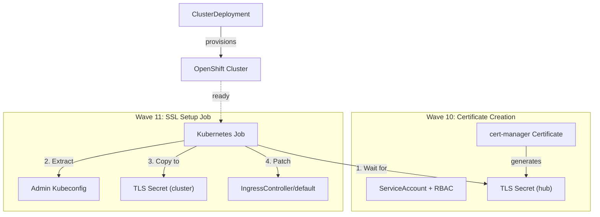

# Post-Provision SSL Certificate Setup

This document describes the automated SSL certificate setup that runs after OpenShift cluster provisioning via ArgoCD sync waves.

## Overview

The post-provision SSL feature automatically configures wildcard TLS certificates for newly provisioned OpenShift clusters. This replaces the previous external Ansible Automation Platform (AAP) workflow with a native GitOps/ArgoCD approach.

When a cluster is provisioned:

1. A `cert-manager` Certificate resource is created on the hub cluster
2. cert-manager generates a wildcard TLS certificate
3. A Kubernetes Job waits for the cluster to be ready
4. The Job copies the TLS certificate to the provisioned cluster
5. The Job patches the cluster's default IngressController to use the certificate

## Prerequisites

These components must already be configured on the hub cluster:

- **cert-manager operator** installed and running
- **ClusterIssuer** named `letsencrypt-production` (or your preferred issuer) configured
- **DNS zone** in Route53 for wildcard certificate validation
- **ArgoCD project** permissions for `openshift-ingress` namespace

## How It Works

### Sync Wave Ordering

ArgoCD sync waves ensure proper sequencing:

- **Wave 0 (default):** Cluster provisioning resources (ClusterDeployment, MachinePool, etc.)
- **Wave 10:** SSL Certificate and RBAC resources
- **Wave 11:** SSL setup Job

### SSL Setup Flow



### Job Steps

The SSL setup Job performs these steps:

1. **Wait for certificate:** Polls for the cert-manager generated TLS secret (up to 6 minutes)
2. **Extract cluster kubeconfig:** Gets admin credentials from Hive-generated secret
3. **Wait for cluster API:** Ensures the provisioned cluster API is reachable (up to 10 minutes)
4. **Create TLS secret:** Copies the certificate data to the cluster's `openshift-ingress` namespace
5. **Patch IngressController:** Updates the default IngressController to use the custom certificate

## Verifying SSL Setup

After cluster provisioning completes:

### 1. Check the SSL setup Job status

```bash
# Replace <cluster-name> with your cluster name
oc get job <cluster-name>-ssl-setup -n <cluster-name>

# View Job logs
oc logs job/<cluster-name>-ssl-setup -n <cluster-name>
```

### 2. Verify certificate on the hub cluster

```bash
oc get certificate <cluster-name>-wildcard-certificate -n openshift-ingress
oc get secret <cluster-name>-wildcard-certificate -n openshift-ingress
```

### 3. Test SSL on the provisioned cluster

```bash
# Extract cluster kubeconfig
oc extract secret/<cluster-name>-admin-kubeconfig -n <cluster-name> --to=.

# Check IngressController configuration
oc --kubeconfig=./kubeconfig get ingresscontroller default -n openshift-ingress-operator -o yaml

# Test HTTPS access
curl -k https://console-openshift-console.apps.<cluster-name>.<domain>/
```

### 4. Browser verification

Navigate to your cluster's console URL:
```
https://console-openshift-console.apps.<cluster-name>.<domain>/
```

The certificate should be valid and issued by your configured CA.

## Troubleshooting

### SSL setup Job fails

**Check Job status and logs:**
```bash
oc describe job <cluster-name>-ssl-setup -n <cluster-name>
oc logs job/<cluster-name>-ssl-setup -n <cluster-name>
```

**Common issues:**

| Error | Cause | Solution |
|-------|-------|----------|
| "Certificate secret not found" | cert-manager hasn't generated the certificate | Check cert-manager logs, verify ClusterIssuer |
| "Target cluster API not reachable" | Cluster provisioning still in progress | Wait for ClusterDeployment to reach "Provisioned" status |
| "Permission denied" | RBAC issues | Verify ArgoCD project allows Certificate resources |
| "TLS certificate secret is missing tls.crt or tls.key" | Malformed certificate | Check cert-manager Certificate status |

### Certificate not generated

**Check cert-manager:**
```bash
# Verify ClusterIssuer
oc get clusterissuer letsencrypt-production

# Check Certificate status
oc describe certificate <cluster-name>-wildcard-certificate -n openshift-ingress

# Check cert-manager logs
oc logs -n cert-manager deployment/cert-manager
```

### Cluster API not responding

**Check cluster provisioning status:**
```bash
# Check ClusterDeployment status
oc get clusterdeployment <cluster-name> -n <cluster-name> -o yaml

# View provision job logs
oc logs -n <cluster-name> job/<cluster-name>-provision
```

### IngressController not updated

**Manually verify and fix:**
```bash
# Extract cluster kubeconfig
oc extract secret/<cluster-name>-admin-kubeconfig -n <cluster-name> --to=.

# Check current IngressController config
oc --kubeconfig=./kubeconfig get ingresscontroller default -n openshift-ingress-operator -o yaml

# Manually patch if needed
oc --kubeconfig=./kubeconfig patch ingresscontroller default \
  -n openshift-ingress-operator \
  --type=merge \
  -p '{"spec":{"defaultCertificate":{"name":"<cluster-name>-wildcard-certificate"}}}'
```

## Configuration

### Customizing the ClusterIssuer

To use a different certificate issuer, modify the `issuerRef` in:
`post-provision-tasks/ssl/base/certificate.yaml`

### Adjusting timeouts

The SSL setup Job has these configurable timeouts:
- Certificate wait: 360 seconds (6 minutes)
- Cluster API wait: 600 seconds (10 minutes)
- Job activeDeadlineSeconds: 600 seconds (10 minutes)

Modify `ssl-setup-job.yaml` to adjust these values for your environment.

## Security Considerations

- The SSL setup Job runs with minimal RBAC permissions
- TLS private keys are stored as Kubernetes secrets
- The Job deletes itself after successful completion (BeforeHookCreation policy)
- Consider using external secret management for production environments

## Related Documentation

- [Architecture](architecture.md) - Overall system architecture
- [Operations](operations.md) - Cluster operations guide
- [Troubleshooting](troubleshooting.md) - General troubleshooting guide
- [Prerequisites](prerequisites.md) - Setup requirements